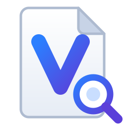

# VisyaDocs

A modern, lightweight PDF reader, editor and converter for Windows, built with WinUI 3. Scanned PDFs can be turned into searchable, copyable text with the OCR engine that is already part of Windows.



## Features

**Reading first**
- Thin title bar (the height of the window buttons) with a Menu button and compact document tabs that shrink and scroll instead of running under the window buttons. Drag it to move the window, double-click it to maximize or restore
- Reading and editing tools live in a floating, rounded tool bar (open, at the top right by default) that folds away to a small handle and can be dragged to either side. Pages are laid out around it, so it never covers them or the side panes
- Page and zoom indicator that fades out while you read
- Layouts: continuous scroll, two pages side by side, two pages with the cover alone, single page (flip with PageUp/PageDown, arrow keys or the wheel)
- Pinch to zoom on touchpads and touch screens (the zoom follows the pinch, not a fixed step per touchpad event), Ctrl + wheel, Ctrl+plus/minus, fit width, fit page
- Full screen (F11, Esc to leave)
- Thumbnails that follow the page you are reading, and an Outline tab with the PDF's bookmarks (table of contents)
- Links work: internal links jump to their page, web links ask before opening in your browser
- Search (Ctrl+F) with highlighted matches, Match case and Whole word options, text selection and copy
- Reopening a file returns to the page and zoom where you left off
- Keyboard shortcuts list (F1 or Menu > Keyboard shortcuts)
- Resizing keeps everything in its place: the window has a minimum size, the thumbnails and side pane make room so the page area stays readable (thumbnails come back when there is space), and the tool bar, notices and search box stay inside the page area (the tool bar scrolls when the window is short)
- Full keyboard use: Tab moves between controls (the tool bar is one stop, Up and Down move inside it), F6 jumps between areas, Alt shows a key letter on every button, tabs are reachable with Tab and the arrow keys, Space pages through the document, Ctrl+G goes to a page
- Smooth motion: zoom commands glide to the new size, nearby page jumps scroll, single pages slide when flipped, panels fade and slide in. All of it is skipped when animations are turned off in Windows
- Document properties (Ctrl+D): title, author, dates, PDF version, page size, security and permissions

**Pages**
- Right click a thumbnail to rotate a page, delete it, or extract pages into a new PDF (opens in a new tab). All undoable

**Password protected and restricted PDFs**
- Opening asks for the password. Saving keeps the protection
- Menu > "Remove password and restrictions" saves a copy without encryption: no password and no limits on printing, copying or changes. The copy opens in a new tab and the original file is not changed. For files whose author restricted them, VisyaDocs asks first and reminds you to do this only for documents you have the right to use that way (the same thing `qpdf --decrypt` does)
- Printing a PDF whose author disallowed printing asks for confirmation, then prints normally
- Adding a password is not possible: PDFium, the PDF engine, can read encryption but cannot write it

**Fill and sign**
- **Fill PDF forms**: text fields, check boxes, radio buttons and drop-downs are filled in place and saved into the PDF
- **E-sign**: draw a signature (mouse, pen or finger), type it in a handwriting font, or use an image. Move and resize it on the page, optionally add the date. Up to three signatures are remembered. Signature fields in forms offer "Sign here"
- (This is a visual signature, like "Fill & Sign". Certificate based digital signatures are not included.)

**Edit**
- **Edit text**: click existing text and change it in place. The original embedded font is kept when it can show the new text, otherwise the run is rebuilt with a matching standard font at the same position, size and color
- **Add text**: click anywhere, type (multi line), choose size and color
- **Comments** (sticky notes) and **highlights**, with a comments pane
- Undo / redo for every edit, safe save (writes a temporary file first)

**Print**
- Standard Windows print dialog (printer, page range, current page, copies). Pages print as sharp vector output, landscape pages turn to fill the sheet, comments, highlights and form values are included

**Convert**
- **OCR**: "Make searchable" adds an invisible text layer to scanned pages. "Extract text" shows all text, using OCR for scanned pages
- Export to Word (.docx), plain text (.txt), PNG or JPEG images (with page ranges and DPI). Scanned pages are recognized automatically during export
- Images to PDF (JPG, PNG, TIFF, HEIC, ...). JPEGs are embedded without re-encoding
- Merge PDFs, append pages or images to an open document

**Look and feel**
- Themes: System (follows Windows), Light, Dark, Black
  - Light is a soft grey instead of stark white, to reduce eye strain
  - Dark is the Windows style dark grey; Black is pure black (great on OLED screens)
  - Pages can be dimmed slightly in Dark and Black for night reading
- Settings is a page inside the app (Menu > Settings), every change applies at once
- Icons are vector (SVG) and render sharp at any display scale. There are two icon sets tuned for contrast: a deeper one for the Light theme and a brighter one for Dark and Black, so icons stay readable on every background
- Color icons in Microsoft's Fluent style (see Third party notices)
- App logo and .pdf file icon (the logo master is `assets/icon/visyadocs.png`)
- One window: opening another PDF from Explorer adds a tab to the running window
- Settings > "Open PDFs with VisyaDocs" registers the app for .pdf files (current user, no admin) and opens Windows Default apps so you can pick it
- Tool buttons have accessible names for screen readers

## Why it is light

| Part | Choice |
|---|---|
| UI | WinUI 3 (Windows App SDK 1.8, only the WinUI and Foundation packages, no AI/ML runtimes) |
| PDF engine | [PDFium](https://pdfium.googlesource.com/pdfium/) via a thin P/Invoke layer, one native DLL |
| OCR | `Windows.Media.Ocr`, built into Windows, uses the OCR language packs you already have |
| Images | Windows Imaging Component, built into Windows |
| Word export | A small OOXML writer, no Office SDK |
| Runtime | .NET 10, Native AOT, trimmed, self contained: no .NET install needed |

Measured on CI (x64, Native AOT, no debug symbols): the app folder is about 67 MB (29 MB zipped). About 45 MB of that is the bundled WinUI runtime, which is what lets the app run from a folder with nothing to install; VisyaDocs itself is about 8 MB and PDFium about 7 MB. The CI job prints the size in its summary.

### Memory

Only pages on screen (plus a little ahead) keep a rendered image, page images are reused while you scroll, tabs in the background and a minimized window give their images back, and thumbnails are kept only while visible. CI opens an 80 page PDF, scrolls through every page at 200% and reports the memory use in the job summary.

## Requirements

- Windows 10 1809 (build 17763) or newer, or Windows 11. x64 or ARM64.
- For OCR: at least one Windows language with the "Optical character recognition" feature (Settings > Time & language > Language & region > language options). English is present on most systems.

## Build

Needs the .NET 10 SDK. Visual Studio 2022/2026 with the "Windows application development" workload is the easiest way to run and debug.

```powershell
# Run tests (the PDFium binary for your machine is downloaded automatically on first build)
dotnet test tests/VisyaDocs.Core.Tests
dotnet test tests/VisyaDocs.Platform.Tests

# Build and run the app
dotnet build src/VisyaDocs.App -p:Platform=x64
.\src\VisyaDocs.App\bin\x64\Debug\net10.0-windows10.0.19041.0\win-x64\VisyaDocs.exe

# Publish a self contained Native AOT build to artifacts\VisyaDocs-win-x64
dotnet publish src/VisyaDocs.App -c Release -p:Platform=x64 -p:PublishProfile=win-x64
```

Use `ARM64` / `win-ARM64` for ARM devices. An MSIX package (with the .pdf file association and icon) can be produced with `-p:WindowsPackageType=MSIX`.

The core library (`VisyaDocs.Core`) has no Windows dependencies, so its tests also run on Linux and macOS.

### Regenerating icons

Toolbar icons: `python build/export_ui_icons.py` (standard library only). It writes both icon sets and `Themes/Icons.xaml`.

App icon:

Replace `assets/icon/visyadocs.png` (a large square-ish PNG with a transparent background), then:

```bash
pip install cairosvg pillow
python build/export_icons.py
```

## Project layout

```
src/VisyaDocs.Core      PDFium interop, document model, editing, export (PNG, DOCX, TXT)
src/VisyaDocs.Platform  Windows OCR and image codecs
src/VisyaDocs.App       WinUI 3 app: shell, viewer, tools, themes, icons
tests/                  xUnit tests for Core (cross platform) and Platform (Windows)
build/                  PDFium download targets, icon export script
```

## Known limitations

- Text editing works on text runs as the PDF stores them. Some PDFs store one word or even one character per run, so an edit may cover a smaller piece than a whole line.
- When the embedded font cannot show the new characters, the replacement uses Helvetica (or Arial for non Latin text), so the look can differ slightly from the original.
- Text written into CJK scripts needs a font that covers them; Arial is used as the fallback.
- Undo history is limited to 30 steps and about 64 MB, so very large files keep fewer steps.
- Password protection cannot be added (see above).

## Third party notices

Toolbar icons are built from Microsoft's [Fluent UI System Icons](https://github.com/microsoft/fluentui-system-icons) (MIT license, see `assets/ui-icons/fluent/LICENSE`). Official color icons are used as they are; icons without a color variant are recolored with the same gradient ramps by `build/export_ui_icons.py`.

## License of dependencies

PDFium binaries come from [bblanchon/pdfium-binaries](https://github.com/bblanchon/pdfium-binaries) (Apache 2.0 / BSD). Windows App SDK and CommunityToolkit.Mvvm are MIT licensed.
